# Contribuir al Trabajo de Gestor de palabras


# Instruciones:

Para contribuir en este trabajo  nos dividiremos en 4 grupos. Cada grupo ha de tener almenos un representante y cada grupo deberá de hacer un Fork a este repositorio, el representate sera colaborador de este repositorio (upstream). Se asignará a cada grupo unas tareas, las cuales deben ser creadas en **[Issues](https://github.com/Jaim8RR/apestosoCleanCodeDAW/issues)** de este repositorio, vuestro representante sera el que haga los pull request desde vuestro fork a este repositorio.

# ¿Como hacer un fork?
Haz click en este **[Enlace](https://github.com/Jaim8RR/apestosoCleanCodeDAW/fork)**, te llevará a github y te saldrá la siguiente pantalla. 


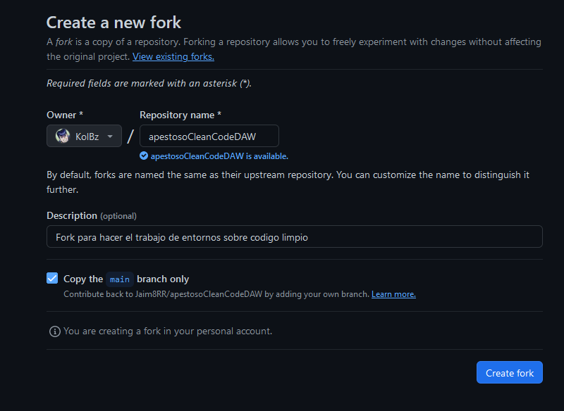

Apartir de aqui como lo hayais hecho en ocasiones anteriores cambiais el codigo(recordad, almenos un push a vuestro repositorio por persona).
### Importante  
Recuerda mantener tu fork actualizado  
 

## Pull request
cuando hayais terminado una tarea de tantas podeis hacer un pull request, un pull request es una peticion que le haces al repositorio del que te has forkeado (upstream), de que incorpore los commits que has hecho en tu fork. Esto lo haces sobre una rama.

Aqui hay dos ejemplos de como hacer el pull:  


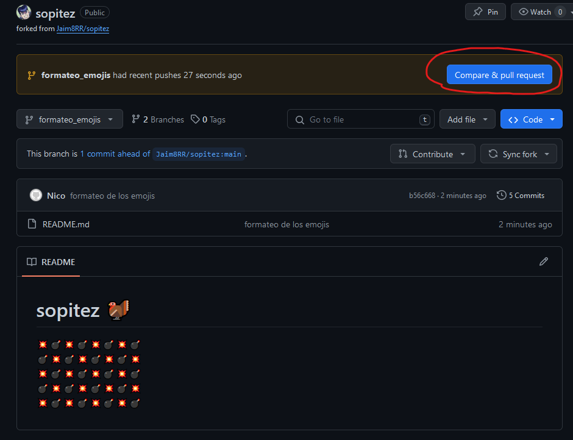

Esta es la alternativa si no te sale sugerido.  
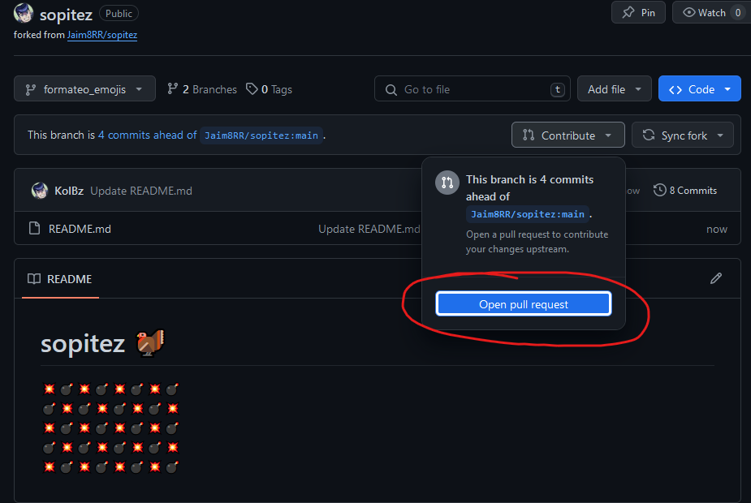

Tras esto te saldrá la siguiente ventana:

Puedes (y deberias) poner la descripcion , comparar con la rama a la que vas a hacer push etc.
También hacer referencia por medio de un link a la issue que puedes estar resolviendo.


Y aquí eliges contra que **rama**  


## Aceptar pull request
Los contribuidores o representantes de los grupos podrán aceptar estos pull request desde **[Pull request](https://github.com/Jaim8RR/sopitez/pulls)**  

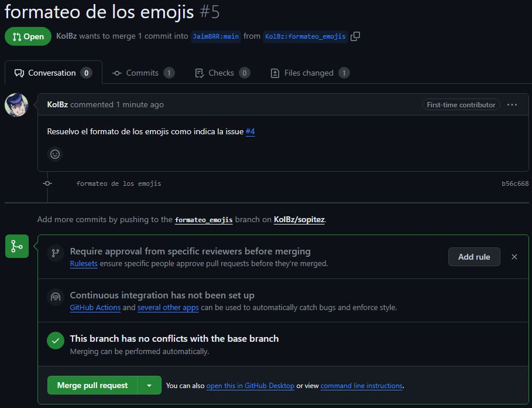

Los que tengais permisos para aceptar pulls porfavor, revisad que sea adecuado, tanto el cambio como la rama etc.


## _El Repositorio:(vuestro repositorio)_
Para copiar el repositorio se usa el siguente comando:
```
git clone <URL del repositorio>
```
Si este paso te da error mira el apartado **Recuerda tener configurada tu maquina**, lo encontraras abajo del todo
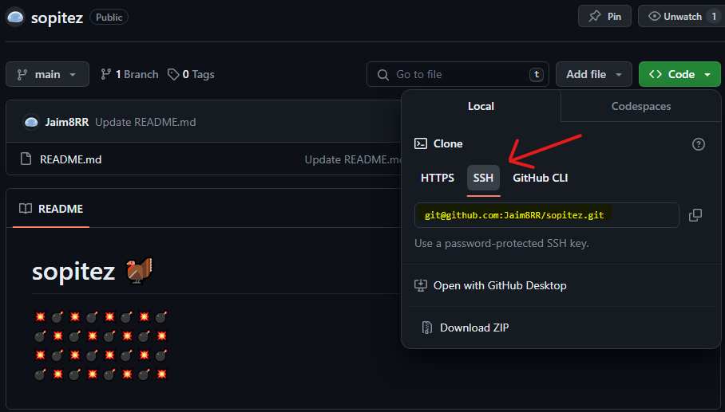 
 

Clona un repositorio existente desde una URL.

### _Ramas:_

En principio trabajaremos desde la rama dev y solo mergearemos al main versiones que creamos finales del codigo.  
### Importante:
**Hay que crear una rama con el nombre del cambio(o issue), esta rama es la que luego intentarás hacer un pull request si cumple las condiciones**   
Opcion 1 crea y te cambia a la nueva rama:  
```
git switch -c "Nombre_de_tu_issue_o_cambio"
```
Y haces los cambios que tengas que hacer
```
git add nombreDeTusFicheros
```
```
git commit nombreDeTusFicheros -m  "tu mensaje ej: X fichero creado/modificado"
```
Solo hay que comitear lo que cambias ni mas ni menos.
```
git pull -u Origin dev
```
# _¿Qué son las issues?_

Iremos haciendo una cantidad de "Issues" en github con cosas que falten por cambiar, como por ejemplo:

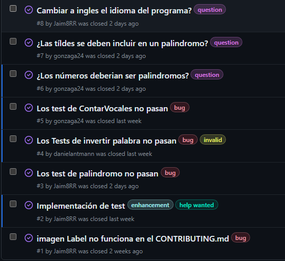  
En los Issues se pueden asignar personas para que se encarguen de ellas, es como una lista de **TODO**, de cosas por hacer. No tiene porque ser un problema puede ser una feature o mejora también.


Con el **@NombreDeUsuario** puedes mencionar a alguien y responder a una Issue:

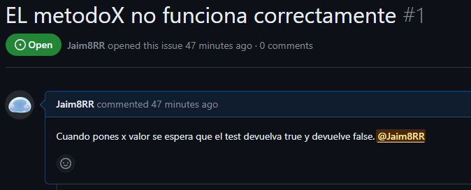

Con los Label puedes asignarle diferentes etiquetas. Puedes incluso crear tú nuevas.  
## Estas son las 9 predeterminadas:

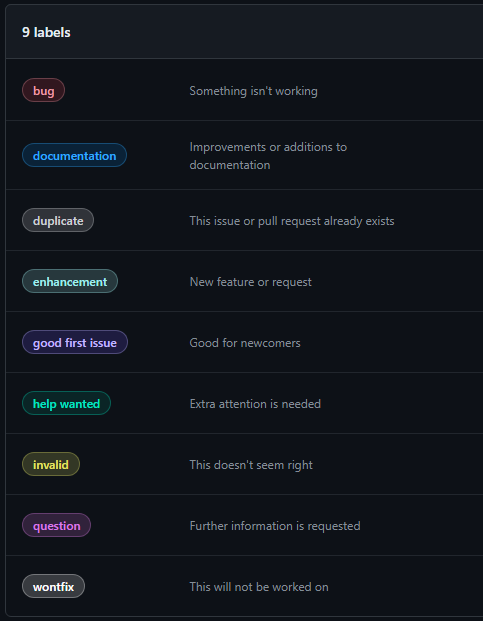

Y tambien podemos assignar a X numero de personas para que resuelvan la Issue (en este caso a los representante/s de cada grupo):

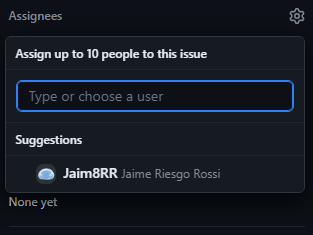

De forma que iremos viendo el código y haciendo issues asignandosela a cada miembro.

# Recuerda tener configurada tu maquina:

Configuración:

```
git config --list → Muestra la configuración actual de Git.
git config --global user.name "Tu Nombre" → nombre de usuario.
git config --global user.email "tu@email.com" → Correo electrónico.
```
## Configuración de Clave SSH en GitHub

Esta guía proporciona instrucciones paso a paso sobre cómo configurar una clave SSH en tu cuenta de GitHub.

### Paso 1: Verificar si ya tienes una clave SSH

Antes de generar una nueva clave SSH, verifica si ya tienes una ejecutando el siguiente comando en tu terminal:   
el ~/ hace referencia a raiz no es necesario.

```
ls -al ~/.ssh
```
#### Si la tienes:
```
cat ~/.ssh/id_rsa.pub
```  
copia el contenido y pasa al cuarto paso.
(Mira paso 3 si no te queda claro)

### Paso 2: Generar una nueva clave SSH(Solo si no tienes una ya)

Si no tienes una clave SSH, utiliza el siguiente comando para crearla:

```
ssh-keygen -t rsa -b 4096 -C "correo@ejemplo.com"
```
No rellenes ningun campo, simplemente pulsa enter hasta que te salga algo asi:  
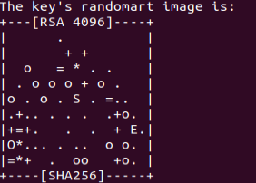
### Paso 3: Copiar la clave SSH
```
cat ~/.ssh/id_rsa.pub
```
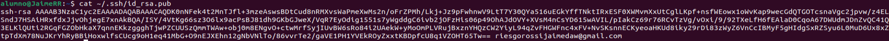

### Paso 4: Meter tu clave SSH en GitHub
En [Github](https://github.com/settings/keys)🔑 podemos poner lo que tenemos copiado al clickar en New SSH Key
